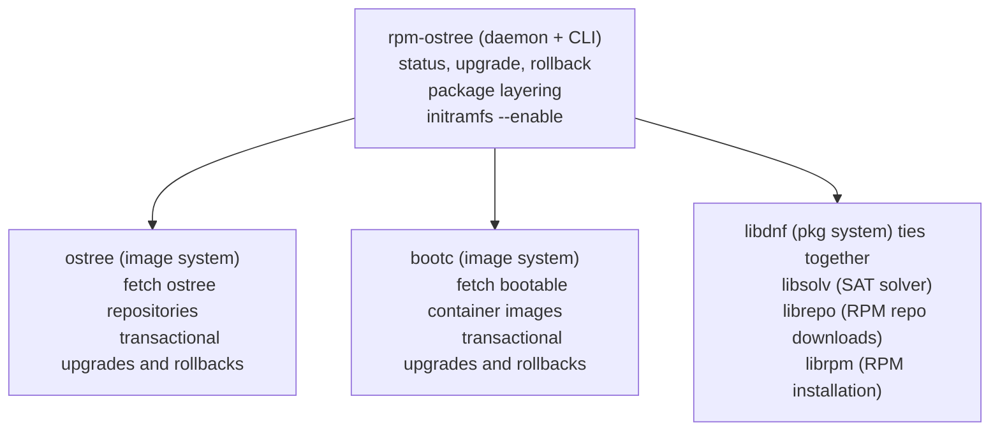

# rpm-ostree: A true hybrid image/package system

rpm-ostree is a hybrid image/package system.  It combines
[libostree](https://ostreedev.github.io/ostree/) as a base image format,
and accepts RPM on both the client and server side, sharing code with the
[dnf](https://en.wikipedia.org/wiki/DNF_(software)) project; specifically
[libdnf](https://github.com/rpm-software-management/libdnf). and thus bringing
many of the benefits of both together.

NOTE: Currently, development focus has shifted to [bootc](https://github.com/containers/bootc), [dnf](https://github.com/rpm-software-management/dnf5/), and the ecosystem around those tools. However, rpm-ostree is widely in use today in many upstream projects and downstream products and continues to be supported. In general, new major features related to bootable containers should land in those projects instead.

**Features:**

 - Transactional, background image-based (versioned/checksummed) upgrades, using both bootable container images as well as an "ostree native" HTTP model
 - OS rollback without affecting user data (`/usr` but not `/etc`, `/var`) via libostree
 - Client-side package layering (and overrides)
 - Custom base images via `rpm-ostree compose image` (container) or `rpm-ostree compose tree` (ostree repo)

## Documentation

For more information, see the [project documentation](docs/index.md) or the
[project documentation website](https://coreos.github.io/rpm-ostree).

## License

rpm-ostree includes code licensed under GPLv2+, LGPLv2+, (Apache 2.0 OR MIT).
For more information, see [LICENSE](https://github.com/coreos/rpm-ostree/blob/main/LICENSE).
